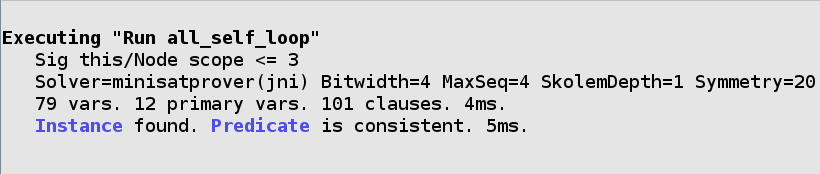

.. _commands:

++++++++
Commands
++++++++

A :dfn:`command` is what actually runs the analyzer. It can either find
models that satisfy your specification, or counterexamples to given
properties.

By default, the analyzer will run the top command in the file. A
specific command can be run under the ``Execute`` menu option.

.. _run:

``run``
=======

**run** tells the analyzer to find a matching example of the spec.

``run pred``
------------

Find examples where ``pred`` is true. If no examples match, the analyzer
will suggest the predicate is inconsistent (see `unsat core <unsat-core>`). The
predicate may be consistent if the `scope <scopes>` is off.

.. code:: alloy

   sig Node {
       edge: set Node
   }

   pred self_loop[n: Node] {
     n in n.edge
   }

   pred all_self_loop {
     all n: Node | self_loop[n]
   }

   run all_self_loop

The analyzer will title the command as the predicate.

``run {constraint}``
--------------------

Finds an example satisfying the ad-hoc constraint in the braces.

.. code:: alloy

   // some node with a self loop
   run {some n: Node | self_loop[n]}

.. TIP:: The analyzer will title the command ``run${num}``. You can give the command a name by prepending the ``run`` with ``name:``:

.. code:: alloy

   some_self_loop:run {some n: Node | self_loop[n]}

.. _check:

  
``check``
=========

**check** tells the Analyzer to find a counterexample to a given
constraint. You can use it to check that your specification behaves as
you expect it to.

.. _assert:

Unlike with ``run`` commands, ``check`` uses **assertions**:

.. code:: alloy

   assert no_self_loops {
       no n: Node | self_loop[n]
   }

   check no_self_loops

Asserts may be used in ``check`` commands but not ``run`` commands.
Assertions may not be called by other predicates or assertions.

You can also call ``check`` with an ad-hoc constraint:

.. code:: alloy

   check {no n: Node | self_loop[n]}

``check`` can also be given a named command.

.. _scopes:

Scopes
======

All alloy models are **bounded**: they must have a maximum possible
size. If not specified, the analyzer will assume that there may be up to
three of each top-level signature and any number of relations. This is
called the **scope**, and can be changed for each command.

Given the following spec:

.. code:: alloy

   sig A {}
   sig B {}

We can write the following scopes:

.. _exactly:

-  ``run {} for 5``: Analyzer will look for models with up to five
   instances of each A and B.
-  ``run {} for 5 but 2 A``: Analyzer will look for models with up to
   two instances of A.
-  ``run {} for 5 but exactly 2 A``: Analyzer will only look for models
   with *exactly two* A. The exact scope *may* be higher than the
   general scope.
-  ``run {} for 5 but 2 A, 3 B``: Places scopes on A and B.

If you are placing scopes on all of the signatures, the ``for N except``
is unnecessary: the last command can be written as
``run {} for 2 A, 3 B``.

.. TIP:: When using `Arithmetic Operators <integers>`, you can specify ``Int`` like any other signature:

  .. code:: alloy

     run foo for 3 Int

.. NOTE:: You cannot place scopes on relations. Instead, use a predicate.

  .. code:: alloy

     sig A {
       rel: A
     }

     run {#rel = 2}

.. rst-class:: advanced

Scopes on Subtypes
----------------------

Special scopes *may* be placed on `extensional subtypes <extends>`. The following is valid:

.. code:: alloy

   sig Plant {}

   sig Tree extends Plant {}
   sig Grass extends Plant {}

   run {} for 4 Plant, exactly 2 Tree

``Grass`` does not need to be scoped, as it is considered part of
``Plant``. The maximum number of atoms for a subtype is either it or its
parent’s scope, whichever is lower. The parent scope is shared across
all children. In this command, there are a maximum of four ``Plant``\ s,
exactly two of which will be ``Tree`` atoms. Therefore there may be at
most two ``Grass`` atoms.

In contrast, special scopes *may not* be placed on `subset types <subtype in>`. The following is invalid:

.. code:: alloy

   sig Plant {}

   sig Seedling in Plant {}

   run {} for 4 Plant, exactly 2 Seedling

Since ``Seedling`` is a subset type, it may not have a scope. If you
need to scope on a subtype, use a constraint:

.. code:: alloy

   run {#Seedling = 2} for 4 Plant
