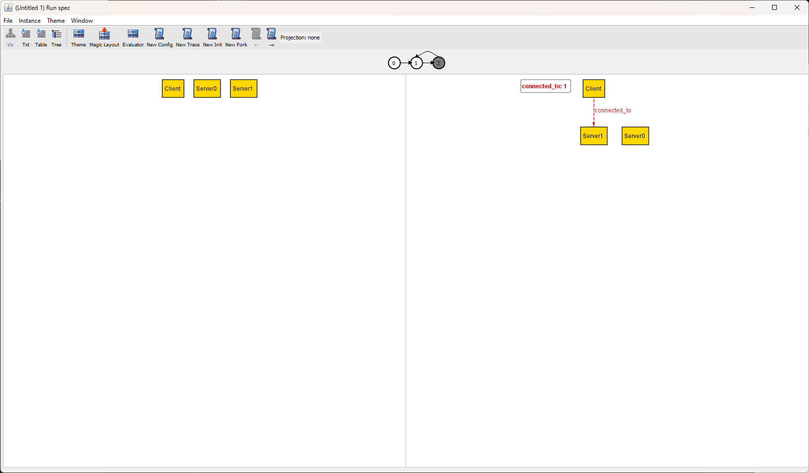

.. _visualizer:

++++++++++
Visualizer
++++++++++

Given the following model

.. literalinclude:: specs/visualizer.als

..
  
  ::
    
    fact "demo" {
      let unroot = Dir - Root |
        contents = Root -> unroot + unroot -> Dir + ((Dir - Root) -> File)
    }

One counterexample to ``RootTop`` is a directory that contains the root. In the Visualizer, this looks like

.. image:: img/visualizer.png

This page will cover all functionality of the visualizer. See below for models using :ref:`time`.

.. attention:: The XML for this example can be downloaded :download:`here <specs/visualizer-counterexample.xml>`.

.. Tip:: 

    The model visualizer names atoms like ``Atom$0``, ``Atom$1``, etc. This can sometimes be hard to follow in the visualizer. To give things qualified names, instead write:

    ::

       abstract sig Base {
        -- relations here
       }

       lone A, B, C, D extends Base {}

       run {} for 2 Base

    This will guarantee the values have better names.

Menu Bar Functions
------------------

File
~~~~

-  **Open/Export To**: Visualizations can either be exported to a
   graphviz diagram or to XML. Saved XML can be reloaded into the
   visualizer with the open option without needing to first reevaluate
   the spec.

Instance
~~~~~~~~

-  **Show Next Solution/Next:** Returns another solution that satisfies the model (or is a valid counterexample). The evaluator can only move forward in solutions, not backwards. If you would like to see a previous solution, you will need to rerun the model.

Themes
~~~~~~~~~~~

See `reusing-themes`.

Output options
--------------

The standard view is the **visualizer**. The other three options are

-  Text

  .. code::

     seq/Int={0, 1, 2, 3}
     String={}
     none={}
     this/Object={Dir$0, File$0, Root$0}
     this/Dir={Dir$0, Root$0}
     this/Dir<:contents={Dir$0->Dir$0, Dir$0->File$0, Dir$0->Root$0, Root$0->Dir$0}
     this/Root={Root$0}
     this/File={File$0}
     skolem $RootTop_o={Dir$0}

-  Tree

   .. image:: img/tree.png

-  Table

  .. code::

    ┌────────┬────────┐
    │this/Dir│contents│
    ├────────┼────────┤
    │Dir⁰    │Dir⁰    │
    │        ├────────┤
    │        │File⁰   │
    │        ├────────┤
    │        │Root⁰   │
    ├────────┼────────┤
    │Root⁰   │Dir⁰    │
    └────────┴────────┘
     
    ┌───────────┬────┬─────┬─────┐⁻¹
    │this/Object│Dir⁰│File⁰│Root⁰│  
    └───────────┴────┴─────┴─────┘

.. warning:: The table view shows the atoms in a human readable form, for example, writing ``Root⁰`` instead of ``Root$0``. In the :ref:`evaluator <evaluator>`, however, you need to write ``Root$0``.

Themes
~~~~~~

See :ref:`themes`.

Magic Layout
~~~~~~~~~~~~~~~

Automatically generates an appropriate theme for the visualization.

.. _evaluator:

Evaluator
---------

The evaluator can be used to run arbitrary commands against the existing
model. It cannot create new signatures, only investigate the current
signatures and relations you currently have. You cannot define new
functions or predicates in the evaluator, only evaluate `expressions`.

.. image:: img/evaluator.png

.. Note:: While the evaluator can evaluate most expressions, it does not have the full capacity of the alloy analyzer. For example, polymorphic domain restriction will not work. Additionally, integer overflow will wrap instead of raising an error.

.. rst-class:: advanced
.. _projections:

Projection
----------

Projections break a complex model into multiple subviews.  Instead of showing relations from the projected signature, each relation will be represented as a text label on the corresponding targets of the relation.

.. todo:: The current example of the visualizer doesn't have projections, find a better example.

.. _visualizer_temporal_models:

Temporal Models
---------------

Models that use :ref:`variables <var>` are temporal models, and are shown differently. Given the following model

.. literalinclude:: specs/visualizer.als

The visualizer might instead look like this:

This represents a single "trace", or sequence of steps that represent the changing variable. On the left is the *current* state, on the right is the *next* state. Clicking on a state in the sequence will jump to that state.

In the evaluator, ``connected_to`` refers to the left state, and ``connected_to'``  refers to the right state. Text and table views will only show the current state.

Instead of "Next [Solution]", there are four more specific options:

#. **New Config**: Changes everything, like "Next" does in non-temporal models.
#. **New Trace**: Keeps the current config and initial state, but finds a new trace.
#. **New Init**: Keeps the non-variable signatures and relations, but changes the initial values of the variables (also giving a new trace). 
#. **New Fork**: Can only be used when looking at a later step. Keeps the config and all prior steps in the trace, but finds a different successor step.

In order of severity, New Config changes more than New Init, which changes more than New Trace, which changes more than New Fork.

.. note:: You'll get an error if you try to find a new trace after having found a new fork. You'll need to find a new config first.